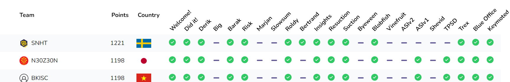

I joined ***BKISC*** team to play CryptoCTF 2023 and finished ***24th*** place.



I completed $3$ challs from the Medium category

## Derek

> Detective [Derik](../challenges/Crypto%20CTF%202023/Derek/Derik.py) possessed an uncanny ability to unravel complex puzzles, his razor-sharp mind weaving through the intricate threads of mystery with effortless precision. ([Output.txt](../challenges/Crypto%20CTF%202023/Derek/output.txt))

The source code is rather short 

```Python
from Crypto.Util.number import *
from secret import C, e, d, p, q, r, flag

O = [1391526622949983, 2848691279889518, 89200900157319, 31337]

assert isPrime(e) and isPrime(d) and isPrime(p) and isPrime(q) and isPrime(r)
assert C[0] * p - C[1] * q >= 0
assert C[2] * q - C[3] * r >= 0
assert C[4] * r - C[5] * p >= 0
assert (C[0] * p - C[1] * q) ** e + (C[2] * q - C[3] * r) ** e + (C[4] * r - C[5] * p) ** e == d * (C[0] * p - C[1] * q) * (C[2] * q - C[3] * r) * (C[4] * r - C[5] * p)
assert C[6] * e - C[7] * d == O[3]

n = e * d * p * q * r
m = bytes_to_long(flag)
c = pow(m, 65537, n)
print(f'C = {C}')
print(f'c = {c}')
```

```
C = [5960650533801939766973431801711817334521794480800845853788489396583576739362531091881299990317357532712965991685855356736023156123272639095501827949743772, 6521307334196962312588683933194431457121496634106944587943458360009084052009954473233805656430247044180398241991916007097053259167347016989949709567530079, 1974144590530162761749719653512492399674271448426179161347522113979158665904709425021321314572814344781742306475435350045259668002944094011342611452228289, 2613994669316609213059728351496129310385706729636898358367479603483933513667486946164472738443484347294444234222189837370548518512002145671578950835894451, 8127380985210701021743355783483366664759506587061015828343032669060653534242331741280215982865084745259496501567264419306697788067646135512747952351628613, 5610271406291656026350079703507496574797593266125358942992954619413518379131260031910808827754539354830563482514244310277292686031300804846114623378588204, 10543, 4]
c = 80607532565510116966388633842290576008441185412513199071132245517888982730482694498575603226192340250444218146275844981580541820190393565327655055810841864715587561905777565790204415381897361016717820490400344469662479972681922265843907711283466105388820804099348169127917445858990935539611525002789966360469324052731259957798534960845391898385316664884009395500706952606508518095360995300436595374193777531503846662413864377535617876584843281151030183895735511854
```
This is RSA encryption using $5$ primes $e, d, p, q, r$, with a public exponent $65537$

In reality, I kinda discovered something interesting before understanding it, how ?

We have these constraints :
$$ C_6e - C_7d = O_3 $$
$$ M = C_0p - C_1q $$
$$ N = C_2q - C_3r $$
$$ P = C_4r - C_5p $$
$$ M^e + N^e + P^e = dMNP $$

## Barak

## PTSD
